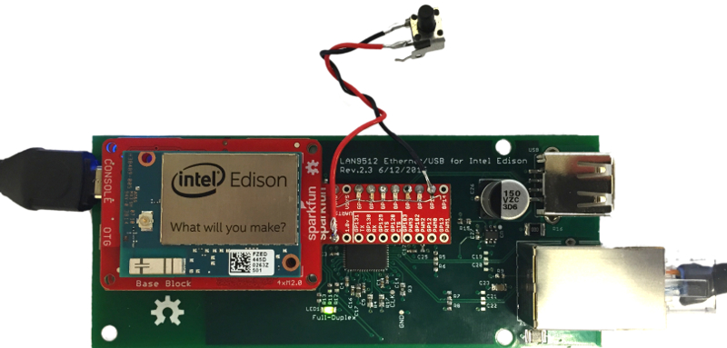

Edison GPIO Example
===================

This demo is to show how to control the Edison's GPIOs using a web interface with a NodeJS server running on the Edison.

### Software Setup ###

1. Clone the repo onto the Edison (or your dev environment):

    ```bash
    git clone https://github.com/LGSInnovations/edison-gpio-example.git
    ```

2. `cd` into the `edison-gpio-example` directory and install dependencies:

    ```bash
    cd edison-gpio-example/
    npm install && bower install
    ```

    *Note: In order to do this, you must have `node` and `npm` [installed](https://github.com/creationix/nvm). Then to install `bower` run `npm install bower --global`*

3. The app will look for the `PORT` environment variable to listen on a particular port. If none is found, it will default to port 8080 and the app will be accessible through your IP address and port or locally at `http://localhost:8080`. To use a different port (like the standard port 80), export the `PORT` variable before running the app:

    ```bash
    export PORT=80
    ```

4. Use `node` or `nodemon` to run the app:

    ```bash
    nodemon app.js
    ```

    *Note: `nodemon` is a utility that automatically checks for updates and restarts the node server, which is great for development. You can alternatively run `node app.js` but you will have to restart the server if you change any code. Run `npm install nodemon --global` to install `nodemon`.*

### Hardware Setup ###

The following pin configuration is assumed, using the [SparkFun GPIO Block](https://www.sparkfun.com/products/13038?_ga=1.52925358.727496411.1438121254) (see image below):

| GPIO Pin | Component                       | MRAA Pin (in code) |
| -------- | ------------------------------- | ------------------ |
| GP44     | Green LED                       | 31                 |
| GP45     | Yellow LED                      | 45                 |
| GP46     | Red LED                         | 32                 |
| GP47     | Red LED                         | 46                 |
| GP48     | Yellow LED                      | 33                 |
| GP49     | Green LED                       | 47                 |
| GP15     | btn tied high with 1K pull-down | 48                 |
| GP14     | Unused                          | 36                 |

